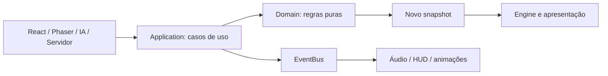
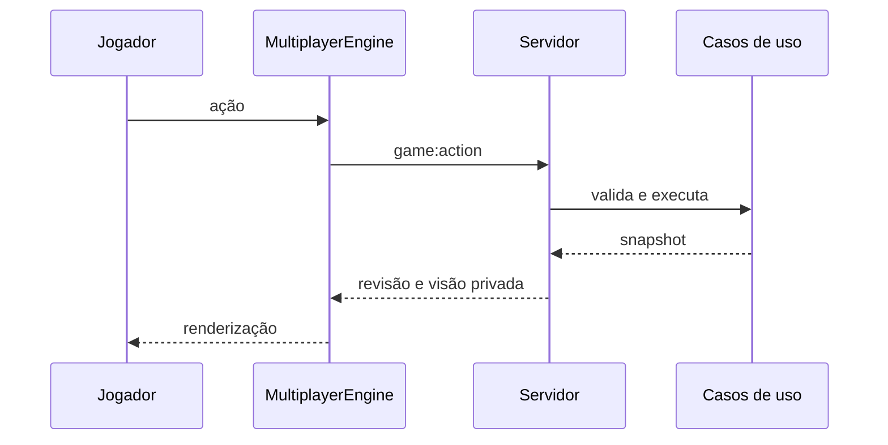

# Blood Arena - Documentação do Projeto

## 1. Visão Geral

### 1.1 Objetivo

Blood Arena é um **TCG (Trading Card Game)**, em português um jogo de cartas colecionáveis, desenvolvido para navegador. Cada jogador administra Vida, Mana, mão, deck, descarte e até cinco criaturas no tabuleiro para reduzir a Vida do adversário a zero.

O projeto possui dois modos:

- **Um jogador:** campanha contra uma IA nas dificuldades Fácil, Médio e Difícil.
- **Multiplayer:** partida entre dois navegadores com servidor autoritativo e comunicação WebSocket.

### 1.2 Tema e recursos

O jogo usa fantasia gótica com vampiros, bruxos, criaturas e magia sombria.

Recursos implementados:

- 64 cartas definidas por dados JavaScript.
- Quatro decks equilibrados de 30 cartas ligados aos quatro avatares.
- Vida, Mana, compra, fadiga, mão, tabuleiro e descarte.
- Mulligan das quatro cartas iniciais.
- Combate simultâneo, Provocar, Fúria, cura, compra e danos direto e em área.
- IA modular com três dificuldades, busca de letal e avaliação heurística.
- Turnos de 90 segundos.
- Multiplayer com salas, senha, reconexão, pausa, revanche e chat.
- Campanha local com pontos, ranks, estatísticas e desbloqueios.
- Perfil, áudio configurável e animações de gameplay.
- Identidade persistente: o nome é informado uma vez e reutilizado no perfil e nas partidas.

Evoluções futuras incluem contas, persistência em servidor, ranking global, matchmaking, construtor de decks, missões e histórico online.

## 2. Arquitetura

O projeto usa **Arquitetura em Camadas**, princípios de **Arquitetura Hexagonal** e comunicação **Event Driven** simples. A explicação detalhada está em [ARCHITECTURE.md](./ARCHITECTURE.md).

| Camada | Local | Responsabilidade |
| --- | --- | --- |
| App | `src/app/` | Composição da aplicação e ciclo das telas. |
| Presentation | `src/presentation/` | Componentes React e estilos. |
| Domain | `src/game/domain/` | Entidades, estado, regras puras, eventos e serviços. |
| Application | `src/game/application/` | Casos de uso, engines, IA, eventos e progresso. |
| Infrastructure | `src/game/infrastructure/` | Phaser, WebSocket, áudio e storage. |
| Shared | `src/shared/` | EventBus independente do domínio. |
| Servidor | `server/` | Salas, autoridade, timers e transporte WebSocket. |

A direção principal é `Presentation -> Application -> Domain`. Infrastructure implementa detalhes tecnológicos. Domain não importa React, Phaser, WebSocket, DOM ou `localStorage`.

### 2.1 Casos de uso

`gameUseCases.js` oferece as entradas compartilhadas para:

- iniciar partida;
- jogar carta;
- atacar herói ou criatura;
- comprar carta;
- encerrar turno;
- trocar e confirmar a mão inicial;
- desistir.

IA, engine local, multiplayer e servidor usam os mesmos casos de uso. As regras puras ficam em `gameRules.js`.

### 2.2 Princípios hexagonais

Os casos de uso são portas de entrada. Repositório de progresso, transporte do chat, EventBus e contrato dos engines funcionam como portas de saída.

React e Phaser são adaptadores de apresentação. WebSocket, áudio e `localStorage` são adaptadores de infraestrutura. Assim, trocar uma tecnologia não exige mover regras para fora do domínio.

Os componentes React não instanciam adaptadores diretamente: `App.jsx` injeta a fábrica do cliente multiplayer e o áudio do chat reage ao EventBus.

### 2.3 Event Driven

Cada engine possui um `EventBus`. Depois que um caso de uso produz um snapshot, `publishGameEvents.js` publica:

- `GAME_STARTED`
- `CARD_PLAYED`
- `CARD_DRAWN`
- `CREATURE_ATTACKED`
- `PLAYER_DAMAGED`
- `PLAYER_HEALED`
- `MANA_CHANGED`
- `TURN_ENDED`
- `GAME_OVER`
- `CHAT_MESSAGE_SENT`
- `CHAT_MESSAGE_RECEIVED`
- `SOUND_REQUESTED`
- `HUD_UPDATED`

O snapshot continua sendo a fonte de verdade. Eventos permitem que áudio, HUD e futuras integrações reajam sem controlar as regras.



## 3. Estrutura de Pastas

```text
src/
  app/
    App.jsx
  presentation/
    components/
    styles/
  game/
    domain/
      entities/
      events/
      rules/
      services/
    application/
      ai/
      engines/
      events/
      progress/
      useCases/
    infrastructure/
      audio/
      multiplayer/
      phaser/
      storage/
  shared/
    events/
server/
public/
```

### Presentation

- `DeckSelection.jsx`: seleção e visualização dos decks.
- `MultiplayerChat.jsx`: mensagens, scroll e contador.
- `MultiplayerLobby.jsx`: criação e entrada em salas.
- `PlayerProfile.jsx`: rank, estatísticas e campanha.
- `styles/`: layout, tema, menus e overlays.

### Domain

- `entities/cards.js`: catálogo e instâncias de cartas.
- `entities/decks.js`: decks, avatares e embaralhamento.
- `entities/gameState.js`: jogadores e estado inicial.
- `entities/playerIdentity.js`: normalização do nome persistente.
- `rules/gameRules.js`: validações e reducers do TCG.
- `events/gameEvents.js`: contrato de eventos.
- `services/aiDifficulty.js`: parâmetros da IA.
- `services/progressRules.js`: regras puras de campanha.

### Application

- `useCases/gameUseCases.js`: ações da partida.
- `useCases/chatUseCases.js`: envio e recebimento de chat.
- `engines/TcgEngine.js`: engine local.
- `events/publishGameEvents.js`: eventos derivados dos snapshots.
- `ai/`: geração, simulação, pontuação e decisão.
- `progress/ProgressService.js`: coordenação de progresso.
- `profile/PlayerIdentityService.js`: caso de uso da identidade do jogador.

### Infrastructure

- `phaser/TcgScene.js`: arena, HUD, input e animações.
- `multiplayer/MultiplayerClient.js`: conexão WebSocket.
- `multiplayer/MultiplayerEngine.js`: snapshots remotos.
- `audio/gameAudio.js`: catálogo, volume e reprodução.
- `audio/connectAudioEvents.js`: consumidor de eventos de som.
- `storage/localStorageProgressRepository.js`: persistência local.
- `storage/localStoragePlayerIdentityRepository.js`: persistência do nome.

## 4. Fluxos Principais

### Início

1. `main.jsx` monta `App`.
2. Na primeira execução, o jogador informa o nome uma única vez.
3. O jogador escolhe modo, avatar e deck.
4. `App` cria o engine.
5. `startGame` cria jogadores e embaralha decks.
6. Cada jogador recebe quatro cartas.
7. O mulligan é confirmado e a partida entra em `playing`.

### Jogar carta

1. Phaser recebe o arrasto.
2. O engine chama `playCard`.
3. O caso de uso executa a regra pura.
4. A regra valida turno, Mana, campo e alvo.
5. Criatura entra no tabuleiro; magia resolve e vai ao descarte.
6. Eventos são publicados.
7. Phaser anima o novo snapshot.

### Ataque

1. O jogador arrasta uma criatura pronta ao alvo.
2. Provocar restringe alvos.
3. Combate entre criaturas causa dano simultâneo.
4. Criaturas derrotadas vão ao descarte do proprietário.
5. A criatura atacante fica exausta.
6. A Vida nunca é exibida abaixo de zero.

### Compra e fadiga

Carta comprada sai do topo do deck. Mão cheia manda a compra ao descarte. Deck vazio aumenta o dano de fadiga, reduz a Vida e gera feedback visual. O primeiro jogador não compra no primeiro turno.

### Fim

Vida zero, fadiga fatal ou desistência definem o vencedor. Phaser apresenta o golpe fatal e o resultado. No solo, o progresso é atualizado. No multiplayer, ambos recebem o resultado e podem pedir revanche.

## 5. IA

A IA usa busca heurística, não aprendizado de máquina:

- `MoveGenerator`: ações legais;
- `MoveSimulator`: aplica os mesmos casos de uso da partida;
- `MoveScorer`: valor de cada ação;
- `BoardEvaluator`: vantagem do estado;
- `DecisionMaker`: letal e beam search;
- `Personality`: pesos de estilo;
- `AIController`: coordenação.

Ela considera letal, Provocar, contra-ataque, sobrevivência, ameaça futura, Vida, Mana, mão, fadiga e ordem das ações. Cura desperdiçada é penalizada.

- **Fácil:** joga legalmente, evita sacrifícios ruins, mas pressiona menos e aceita alternativas próximas da melhor jogada.
- **Médio:** busca equilibrada, baixa aleatoriedade e decisões consistentes.
- **Difícil:** busca mais profunda, letal completo e antecipação das melhores respostas do jogador.

## 6. Multiplayer

O servidor é autoritativo: mantém o estado canônico, valida ações e envia uma visão privada a cada jogador.

- Salas com nome e senha opcional.
- Sessão e reconexão.
- Mulligan de 30 segundos.
- Turno de 90 segundos.
- Pausa compartilhada de 30 segundos.
- Revisões crescentes de snapshot.
- Ocultação da mão e do deck adversários.
- Desistência sincronizada e revanche.
- Chat com histórico de 50 mensagens.



## 7. Progresso

As regras de rank, pontos e desbloqueios ficam no Domain. `ProgressService` recebe um repositório. A implementação atual usa `localStorage`, mas pode ser substituída por uma API sem alterar as regras.

## 8. Tecnologias e Assets

| Tecnologia | Uso |
| --- | --- |
| React 18 | Menus, perfil, lobby, chat e overlays. |
| Phaser 3.90 | Arena, sprites, input, tweens e HUD. |
| Vite 6 | Desenvolvimento, JSX e build. |
| Node.js | Servidor multiplayer e testes. |
| WebSocket | Comunicação em tempo real. |
| localStorage/sessionStorage | Progresso, áudio e sessão. |

Assets:

- `public/arts/cartas/`: cartas.
- `public/arts/avatares/`: avatares.
- `public/arts/ui/`: arena, molduras, barras, menus e botões.
- `public/sounds/`: efeitos.
- `public/fonts/`: fontes.

Imagens não são fonte de regra. Mana, ataque, Vida e efeitos são definidos no Domain.

## 9. Verificação

```bash
npm run lint
npm run build
npm run test:architecture
npm run test:rules
npm run test:ai
npm run test:progress
npm run test:multiplayer
```

`test:architecture` verifica fronteiras entre camadas e eventos básicos de partida e chat.
`npm run check` executa lint, todos os testes e o build de produção em uma única etapa.

## 10. Limitações e Evolução

Limitações atuais:

- `TcgScene.js` ainda concentra partes visuais.
- `App.jsx` coordena várias telas.
- Os contratos são implícitos em JavaScript.
- Alguns sons antigos mantêm fallback direto.
- Eventos de gameplay são derivados da comparação de snapshots.

Próximos passos recomendados:

1. dividir `TcgScene` em HUD, interação e efeitos;
2. criar uma máquina de estados para as telas;
3. tipar contratos de engine e eventos;
4. retornar eventos diretamente dos reducers quando necessário;
5. criar persistência e autenticação no servidor;
6. adicionar testes de interface e contratos WebSocket.

## 11. Execução

```bash
npm install
npm run dev
```

Por padrão, Vite usa a porta `5173` e WebSocket usa `8080`. Os processos também podem ser iniciados com `npm run dev:web` e `npm run server`.

## 12. Conclusão

Blood Arena é um TCG (Trading Card Game) com uma base compartilhada para solo, IA e multiplayer. A refatoração separa regras, casos de uso, apresentação e tecnologias sem reescrever o gameplay.

A estrutura permite evoluir cartas, HUD, áudio, chat, persistência e novos modos com mudanças localizadas. [ARCHITECTURE.md](./ARCHITECTURE.md) registra os limites e fluxos para orientar as próximas implementações.
